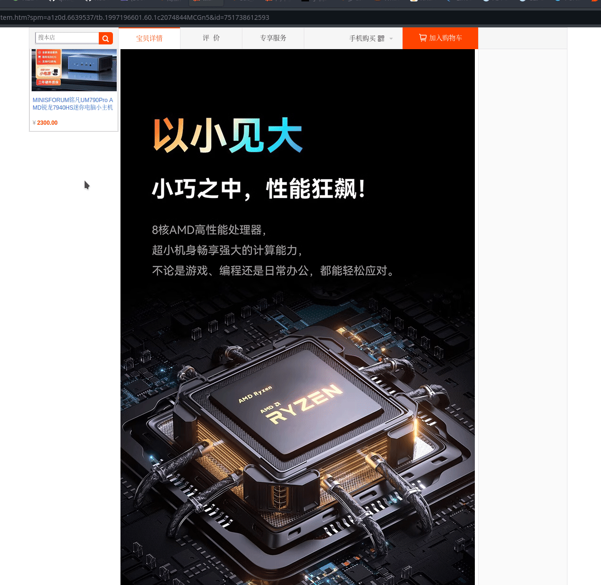

# translate-screen

A command to take a screenshot and translate it automatically.

# Dependencies

- OCR: https://github.com/tesseract-ocr/tesseract
- Translate utility: https://github.com/soimort/translate-shell
- Screenshot tool: https://github.com/naelstrof/maim
- GUI Terminal to display results: https://github.com/kovidgoyal/kitty

```bash
# Screenshot utility
sudo apt install -y maim

# OCR
sudo apt install -y tesseract-ocr libtesseract-dev

# install OCR languages, example for Mandarin, Thai and English only
# get more: https://tesseract-ocr.github.io/tessdoc/Installation.html
sudp apt install -y tesseract-ocr-chi-sim tesseract-ocr-eng tesseract-ocr-tha 

# terminal
sudo apt install -y kitty

# resize utility mogrify
sudo apt install -y imagemagick-6.q16

# translator CLI (add ~/bin to PATH)
# 
sudo apt install -y gawk wget
mkdir ~/bin && cd ~/bin; wget git.io/trans; chmod +x ./trans
```


# Installation

Download executable and put it into PATH
```bash
cd ~/bin && wget -o translate-screen.sh ... 
chmod +x ./translate-screen.sh
```

Add the shortcut in KDE

run `nano ~/.config/.kglobalshortcutsrc` and append the following:

```.rc
[translate-screen.sh.desktop]
_k_friendly_name=translate-screen.sh
_launch=Ctrl+Alt+T,none,translate-screen.sh
```

# Demo
